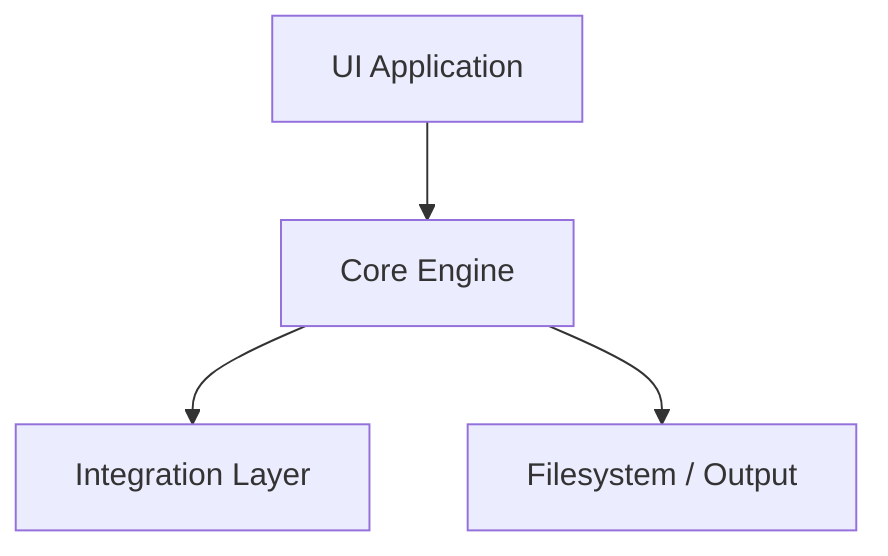
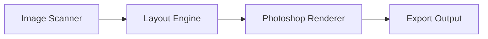

# Photo Tools for Photographers

## 00. Overview & System Architecture

Questo documento e il punto di riferimento principale del progetto.
Definisce la visione generale, l'architettura del sistema, la struttura della documentazione, la filosofia UI e le regole da non rompere durante lo sviluppo.

Va letto prima di:

- progettare un nuovo tool
- generare codice con Codex o altri agent AI
- introdurre nuovi moduli o dipendenze
- modificare la struttura del repository

Non contiene il dettaglio implementativo dei singoli tool: ogni tool avra un proprio file dedicato in `docs/tools/`.

## 1. Obiettivo del progetto

Il progetto consiste in una suite modulare di strumenti professionali per fotografi, pensata per velocizzare workflow reali di studio fotografico e post-produzione.

L'obiettivo non e creare semplici script isolati, ma un hub ordinato di automazioni riutilizzabili, estendibili e coerenti tra loro.

I principali ambiti coperti dal sistema saranno:

- automazioni Photoshop
- export immagini
- impaginazione automatica
- layout per stampa
- fogli provino
- batch workflow
- conversione immagini
- utility operative di studio

## 2. Principi guida

Il progetto deve restare:

- modulare
- estendibile
- stabile
- prevedibile
- semplice da usare
- orientato a workflow fotografici professionali

Principi architetturali:

- la UI raccoglie input e presenta output, ma non contiene logica di business
- il core prende decisioni, valida dati e orchestra i flussi
- i layer di integrazione eseguono operazioni verso Photoshop, filesystem e servizi esterni
- ogni configurazione deve poter essere serializzata
- ogni tool deve poter essere documentato, testato ed evoluto in modo indipendente

## 3. Struttura della documentazione

La documentazione e suddivisa in piu file markdown per mantenere ordine, evitare ambiguita e guidare in modo coerente sia lo sviluppo umano sia la generazione di codice assistita da AI.

```text
docs/
  00-overview.md
  01-tech-stack.md
  02-ui-system.md

  tools/
    auto-layout.md
    export-web.md
    save-open-documents.md
    proof-sheet.md
```

### Ruolo dei file

`docs/00-overview.md`

- visione generale del progetto
- architettura complessiva
- struttura del repository
- regole architetturali obbligatorie

`docs/01-tech-stack.md`

- stack tecnologico
- convenzioni tecniche
- organizzazione moduli
- regole di build, test e configurazione

`docs/02-ui-system.md`

- struttura generale della UI
- pattern dei pannelli
- componenti condivisi
- comportamento coerente dei tool

`docs/tools/*.md`

- un file dedicato per ogni tool
- obiettivi
- input/output
- algoritmo
- struttura dati
- UI specifica
- edge case

## 4. Architettura generale del sistema

Il sistema e composto da tre livelli principali, piu un layer operativo di file/output.



### UI Application

Responsabilita:

- raccogliere input utente
- mostrare preset e configurazioni
- avviare i tool
- esporre stato, log, errori e risultati

La UI non deve contenere logica algoritmica del tool.

### Core Engine

Responsabilita:

- logica di business
- algoritmi
- regole di layout e workflow
- validazioni
- orchestrazione dei moduli

Questo e il cuore del progetto.

### Integration Layer

Responsabilita:

- integrazione con Photoshop
- accesso al filesystem
- eventuali API esterne
- import/export dei dati

Questo layer esegue, ma non decide.

### Filesystem / Output

Responsabilita:

- lettura sorgenti
- scrittura output
- cartelle di lavoro
- esportazioni finali

## 5. Struttura del repository

La struttura iniziale del repository deve seguire questa organizzazione:

```text
photo-tools/
  docs/
    00-overview.md
    01-tech-stack.md
    02-ui-system.md
    tools/
      auto-layout.md
      export-web.md
      save-open-documents.md
      proof-sheet.md

  apps/
    photoshop-plugin/
    cli/

  packages/
    core/
    layout-engine/
    presets/
    shared-types/
    filesystem/
    logging/

  legacy/
    extendscript/
```

### Significato delle aree principali

`apps/`

- applicazioni finali
- plugin Photoshop
- eventuale interfaccia CLI per sviluppo, debug o batch

`packages/`

- moduli riutilizzabili
- logica condivisa
- engine indipendenti
- tipi comuni e utility

`legacy/`

- compatibilita con codice storico
- eventuali script ExtendScript da mantenere separati dal nuovo nucleo

## 6. Filosofia UI generale

L'applicazione deve comportarsi come un hub di strumenti, non come una raccolta disordinata di script.

La UI generale dovra essere chiara, professionale e coerente tra tutti i tool.

Pattern di layout previsto:

```text
+---------------------------------------------------------------+
| PHOTO WORKFLOW TOOLS                                          |
+---------------------------------------------------------------+
| Preset rapidi / stato globale                                 |
+----------------------+----------------------------------------+
| Tools Panel          | Tool Settings                          |
|----------------------|----------------------------------------|
| Auto Layout          | Input                                  |
| Export Web           | Layout Options                         |
| Proof Sheet          | Output Settings                        |
| Save Open Docs       | Advanced Options                       |
|                      |                                        |
|                      | [ Run Tool ]                           |
+----------------------+----------------------------------------+
| Progress / Log / Results                                      |
+---------------------------------------------------------------+
```

### Aree principali della UI

Colonna sinistra:

- elenco dei tool disponibili
- eventuali categorie future
- accesso rapido ai moduli

Pannello centrale:

- impostazioni del tool attivo
- preset rapidi
- sezioni avanzate collassabili
- azione principale di esecuzione

Sezione inferiore o finale:

- log
- progresso
- warning
- risultati finali
- percorso output

## 7. Categorie principali di tool

I tool verranno organizzati per famiglie funzionali:

### Layout

- auto layout
- impaginazione album
- composizioni per stampa

### Export

- export web
- export social
- export stampa

### Batch

- salvataggio documenti aperti
- rinomina file
- conversione formato

### Proof

- fogli provino
- anteprime a contatto

### Workflow

- generazione cartelle progetto
- utility operative di studio

## 8. Primo tool prioritario

Il primo modulo prioritario del progetto e `Auto Layout`.

Questo tool definira buona parte dell'architettura, perche introduce il problema piu complesso: il motore di disposizione automatica delle immagini.

Il cuore del primo tool non e Photoshop, ma il layout engine.
Photoshop deve essere trattato come renderer finale.

### Scomposizione obbligatoria del modulo

Il tool di auto-impaginazione dovra essere suddiviso in tre parti:

1. Scanner immagini
2. Layout engine
3. Renderer Photoshop



### 1. Image Scanner

Responsabilita:

- leggere la cartella immagini
- raccogliere metadata
- classificare orientamento
- preparare i dati in ingresso al motore

### 2. Layout Engine

Responsabilita:

- decidere come distribuire le immagini
- scegliere pattern e regole di impaginazione
- generare pagine e slot

Vincolo fondamentale:

- non deve dipendere da Photoshop

### 3. Photoshop Renderer

Responsabilita:

- creare documenti
- piazzare immagini negli slot generati
- applicare fit, fill e crop
- esportare con la qualita richiesta

## 9. Direzione iniziale del layout engine

La prima versione dell'algoritmo deve essere robusta e controllabile, non eccessivamente intelligente.

Approccio consigliato:

- pattern rule-based
- comportamento prevedibile
- scelta del pattern in base al gruppo di immagini
- minimo spreco di spazio accettabile

Esempi di pattern iniziali:

- 1 foto piena
- 2 verticali affiancate
- 2 orizzontali sopra/sotto
- 3 immagini miste
- 4 immagini in griglia
- 6 immagini tipo provino

Questo approccio semplifica:

- controllo del risultato visivo
- manutenzione del motore
- debugging
- futura estensione verso algoritmi piu sofisticati

## 10. Regole architetturali obbligatorie

Queste regole non devono essere violate:

- nessuna logica di business nel layer UI
- il layout engine deve restare indipendente da Photoshop
- tutti i tool devono avere un file markdown dedicato
- tutte le configurazioni devono essere serializzabili
- i moduli devono essere riutilizzabili
- i preset devono essere separati dalla logica operativa
- il codice nuovo deve rispettare la struttura del repository
- evitare script isolati fuori dai moduli previsti

## 11. Roadmap iniziale

### Step 1

Definire la documentazione base:

- overview
- tech stack
- UI system

### Step 2

Progettare il tool `Auto Layout`.

### Step 3

Costruire il `layout-engine`.

### Step 4

Costruire il renderer Photoshop.

### Step 5

Costruire la UI del tool.

## 12. Istruzioni per agent AI e generazione codice

Quando un agent AI genera codice per questo progetto deve:

- leggere prima `docs/00-overview.md`
- leggere `docs/01-tech-stack.md` prima di proporre stack o struttura moduli
- leggere `docs/02-ui-system.md` prima di generare interfacce
- leggere il file specifico in `docs/tools/` prima di implementare un tool

Regole operative:

- non creare script isolati fuori architettura
- non mescolare UI, logica core e integrazione Photoshop
- non introdurre dipendenze senza una motivazione tecnica chiara
- mantenere i moduli piccoli, leggibili e riutilizzabili

## 13. Prossimi documenti da creare

L'ordine consigliato e:

1. `docs/01-tech-stack.md`
2. `docs/02-ui-system.md`
3. `docs/tools/auto-layout.md`

Questo ordine e importante perche:

- prima fissiamo le regole tecniche
- poi fissiamo il comportamento coerente della UI
- solo dopo entriamo nel dettaglio del primo tool prioritario

## 14. Stato attuale

Al momento questo file rappresenta la base architetturale ufficiale del progetto.

Tutte le implementazioni future dovranno essere coerenti con quanto definito qui, salvo aggiornamenti espliciti della documentazione principale.
