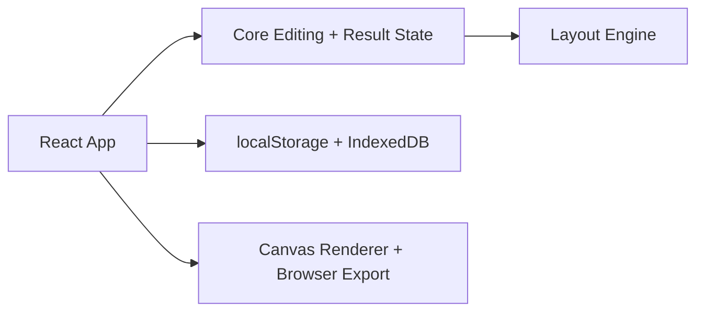

# Photo Tools for Photographers

## 00. Overview & Current Project State

Questo documento descrive l'architettura del repository nello stato attuale verificato il 16 marzo 2026.
La visione del progetto resta quella di una suite di strumenti per fotografi. Oggi il monorepo include
due prodotti operativi con target differenti: `auto-layout-app` e `image-party-frame-app`.

## 1. Obiettivo del repository

Il repository ospita strumenti per velocizzare workflow fotografici reali:

- impaginazione automatica di fogli multifoto
- revisione manuale del layout con drag and drop
- export locale dei fogli generati
- base architetturale riutilizzabile per futuri tool

L'obiettivo non e' una raccolta di script isolati, ma un sistema modulare in cui UI, logica di
layout, preset e tipi condivisi restano separati.

## 2. Stato reale al 16 marzo 2026

Il progetto oggi include:

- una app browser-first `apps/auto-layout-app` sviluppata con React + Vite
- una app browser-first `apps/image-party-frame` sviluppata con React + Vite + server locale Express
- un motore di planning in `packages/layout-engine`
- un layer di orchestrazione e modifica manuale in `packages/core`
- preset foglio e request di default in `packages/presets`
- contratti condivisi in `packages/shared-types`
- schema UI condiviso in `packages/ui-schema`
- un package `packages/filesystem` pronto per utilizzi Node/browser futuri

Funzionalita' gia' disponibili nell'app:

- dashboard progetti
- wizard di onboarding
- fase di setup progetto
- studio layout con modifica manuale
- undo/redo
- duplicazione, riordino e rimozione fogli
- selezione foto attive del progetto
- salvataggio automatico dei progetti in `localStorage`
- persistenza delle immagini in `IndexedDB`
- export fogli in `jpg` e `png`
- import/export progetto in file `.imagetool`

Funzionalita' gia' disponibili in `image-party-frame-app`:

- creazione progetto da cartella immagini
- selezione template preset o custom
- builder template custom con libreria locale
- ordinamento template drag and drop
- validazione layout, workspace crop live e confronto immagine
- export batch con server locale `express + sharp`
- import/export pacchetti JSON per progetto e libreria template

Al momento non esistono ancora:

- plugin Photoshop / UXP
- renderer desktop nativo
- export TIFF reale lato browser
- suite test automatica
- workflow multi-tool oltre ad `auto-layout`
- packaging desktop finale Windows/macOS

## 3. Architettura attuale



### UI application

Responsabilita':

- gestione schermate dashboard / setup / studio
- import immagini dal browser
- interazioni drag and drop
- feedback utente, warning, modali e progress
- esportazione progetto e fogli

### Core

Responsabilita':

- creazione del piano iniziale
- normalizzazione dello stato
- aggiornamento assegnazioni e pagine
- ricalcolo di warning, foto libere e render queue

### Layout engine

Responsabilita':

- scelta template in base agli asset
- assegnazione slot
- batching iniziale delle immagini per foglio

### Storage e export

Responsabilita':

- persistenza browser-side di metadata e blob immagine
- export raster dei fogli
- integrazione opzionale con File System Access API quando disponibile

## 4. Struttura attuale del repository

```text
photo-tools/
  apps/
    auto-layout-app/
    image-party-frame/

  docs/
    00-overview.md
    01-tech-stack.md
    02-ui-system.md
    tools/
      auto-layout.md
      image-party-frame.md

  packages/
    core/
    filesystem/
    layout-engine/
    presets/
    shared-types/
    ui-schema/
```

Nota importante:

- la documentazione storica faceva riferimento a `photoshop-plugin`, `cli`, `logging` e `legacy/`
  come struttura iniziale desiderata
- questi moduli non sono ancora presenti nel repository
- la documentazione deve quindi distinguere tra stato attuale e direzione futura

## 5. Flusso applicativo oggi

L'uso corrente dell'app segue questo percorso:

1. creazione o apertura di un progetto dalla dashboard
2. caricamento immagini reali o dataset demo
3. selezione delle foto attive del progetto
4. configurazione foglio, strategia di planning e output
5. generazione del piano iniziale
6. revisione nello studio layout con editing manuale
7. export dei fogli oppure export del progetto `.imagetool`

## 6. Regole architetturali confermate

Queste regole restano valide anche nello stato attuale:

- la UI non deve contenere la logica di layout
- `layout-engine` deve restare indipendente da Photoshop
- i contratti condivisi vivono in `packages/shared-types`
- preset e valori di default restano fuori dalla UI
- le modifiche manuali alle pagine devono passare dal `core`
- ogni aggiornamento importante del prodotto va riflesso nella documentazione

## 7. Documentazione attiva

I file da tenere aggiornati oggi sono:

- `docs/00-overview.md`: visione generale e stato del repository
- `docs/01-tech-stack.md`: stack effettivamente in uso
- `docs/02-ui-system.md`: flusso UI reale dell'app
- `docs/tools/auto-layout.md`: comportamento del tool operativo
- `docs/tools/image-party-frame.md`: comportamento del tool di framing ed export

## 8. Verifica effettuata

Lo stato documentato in questo file e' stato verificato il 16 marzo 2026 tramite:

- lettura della struttura del monorepo
- controllo dei package e dei componenti principali
- esecuzione di `npm run build`
- esecuzione di `npm run typecheck`
