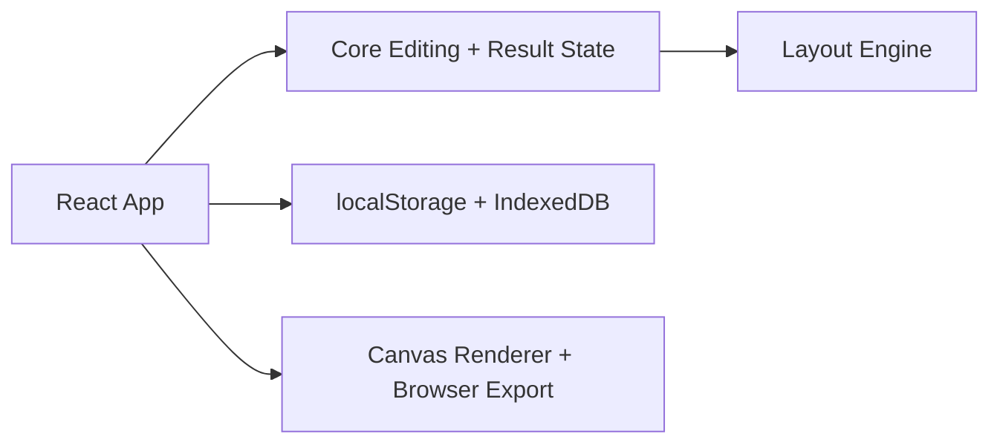

# Photo Tools for Photographers

## 00. Overview & Current Project State


# FileX Suite — Overview & Stato Attuale

Questo documento descrive l’architettura e la visione della suite **FileX** (ex ImageTools), aggiornata a marzo 2026.

## 1. Visione e Obiettivo

FileX è una suite modulare di strumenti per workflow fotografici professionali:

- impaginazione automatica multifoto
- framing batch e crop live
- export locale e batch
- import e archiviazione lavori da SD
- selezione e classificazione foto
- base architetturale riutilizzabile per futuri tool

L’obiettivo è un ecosistema integrato, non una raccolta di script isolati: UI, logica, preset e tipi condivisi sono separati e riusabili.

## 2. Tool Principali (Marzo 2026)

- `auto-layout-app`: impaginazione automatica multifoto (React + Vite)
- `image-party-frame`: batch framing, crop live, export eventi (React + Vite + Express)
- `IMAGE ID PRINT`: foto documento pronte per la stampa, AI/sidecar (React + Vite + Python)
- `archivio-flow`: import e archiviazione lavori da SD (React + Vite + Express)
- `photo-selector-app`: selezione e classificazione foto avanzata (React + Vite)

Moduli condivisi:
- `packages/layout-engine`, `core`, `presets`, `shared-types`, `ui-schema`, `filesystem`

## 3. Stato reale (marzo 2026)

Tutti i tool sono funzionanti e integrabili, ma la suite non è ancora completamente unificata a livello di branding, launcher e stack tecnologico.

**Funzionalità già disponibili:**
- dashboard progetti, wizard onboarding, setup, studio layout, undo/redo, duplicazione/riordino/rimozione fogli, selezione foto, salvataggio automatico, export/import progetti, batch framing, crop live, AI background removal, archiviazione lavori, selezione/classificazione foto.

**Funzionalità in sviluppo o da consolidare:**
- plugin Photoshop/UXP, renderer desktop, export TIFF, suite test automatica, packaging desktop finale, workflow multi-tool completamente integrato.

## 4. Roadmap Unificazione FileX

1. Allineamento documentazione e naming (FileX branding)
2. Aggiornamento launcher principale per includere tutti i tool
3. Uniformazione stack tecnologico (React, dipendenze, pattern UI)
4. Refactor moduli condivisi e servizi
5. Packaging desktop e distribuzione facilitata

## 5. Struttura attuale del repository

```text
filex/
  apps/
    auto-layout-app/
    image-party-frame/
    IMAGE ID PRINT/
    archivio-flow/
    photo-selector-app/

  docs/
    00-overview.md
    01-tech-stack.md
    02-ui-system.md
    tools/
      auto-layout.md
      image-party-frame.md
      image-id-print.md
      archivio-flow.md
      photo-selector.md

  packages/
    core/
    filesystem/
    layout-engine/
    presets/
    shared-types/
    ui-schema/
```

## 6. Flusso applicativo tipico

1. Creazione o apertura progetto dalla dashboard
2. Caricamento immagini reali o dataset demo
3. Selezione foto attive/classificazione
4. Configurazione foglio, strategia di planning/output
5. Generazione piano iniziale/framing/crop
6. Revisione layout, editing manuale, AI background removal
7. Export fogli, export batch, archiviazione lavori

## 7. Regole architetturali confermate

- UI separata dalla logica di layout
- moduli engine/core/preset/tipi condivisi
- preset e valori di default fuori dalla UI
- modifiche manuali passano dal core
- ogni aggiornamento importante va riflesso nella documentazione

## 8. Documentazione attiva

- `docs/00-overview.md`: visione generale e stato del repository
- `docs/01-tech-stack.md`: stack effettivamente in uso
- `docs/02-ui-system.md`: flusso UI reale dell’app
- `docs/tools/`: comportamento dei singoli tool

## 9. Prossimi passi

- Allineamento documentazione e branding FileX
- Aggiornamento launcher e onboarding
- Uniformazione stack tecnologico
- Refactor moduli condivisi
- Packaging desktop

## 3. Architettura attuale



### UI application

Responsabilita':

- gestione schermate dashboard / setup / studio
- import immagini dal browser
- interazioni drag and drop
- feedback utente, warning, modali e progress
- esportazione progetto e fogli

### Core

Responsabilita':

- creazione del piano iniziale
- normalizzazione dello stato
- aggiornamento assegnazioni e pagine
- ricalcolo di warning, foto libere e render queue

### Layout engine

Responsabilita':

- scelta template in base agli asset
- assegnazione slot
- batching iniziale delle immagini per foglio

### Storage e export

Responsabilita':

- persistenza browser-side di metadata e blob immagine
- export raster dei fogli
- integrazione opzionale con File System Access API quando disponibile

## 4. Struttura attuale del repository

```text
photo-tools/
  apps/
    auto-layout-app/
    image-party-frame/

  docs/
    00-overview.md
    01-tech-stack.md
    02-ui-system.md
    tools/
      auto-layout.md
      image-party-frame.md

  packages/
    core/
    filesystem/
    layout-engine/
    presets/
    shared-types/
    ui-schema/
```

Nota importante:

- la documentazione storica faceva riferimento a `photoshop-plugin`, `cli`, `logging` e `legacy/`
  come struttura iniziale desiderata
- questi moduli non sono ancora presenti nel repository
- la documentazione deve quindi distinguere tra stato attuale e direzione futura

## 5. Flusso applicativo oggi

L'uso corrente dell'app segue questo percorso:

1. creazione o apertura di un progetto dalla dashboard
2. caricamento immagini reali o dataset demo
3. selezione delle foto attive del progetto
4. configurazione foglio, strategia di planning e output
5. generazione del piano iniziale
6. revisione nello studio layout con editing manuale
7. export dei fogli oppure export del progetto `.imagetool`

## 6. Regole architetturali confermate

Queste regole restano valide anche nello stato attuale:

- la UI non deve contenere la logica di layout
- `layout-engine` deve restare indipendente da Photoshop
- i contratti condivisi vivono in `packages/shared-types`
- preset e valori di default restano fuori dalla UI
- le modifiche manuali alle pagine devono passare dal `core`
- ogni aggiornamento importante del prodotto va riflesso nella documentazione

## 7. Documentazione attiva

I file da tenere aggiornati oggi sono:

- `docs/00-overview.md`: visione generale e stato del repository
- `docs/01-tech-stack.md`: stack effettivamente in uso
- `docs/02-ui-system.md`: flusso UI reale dell'app
- `docs/tools/auto-layout.md`: comportamento del tool operativo
- `docs/tools/image-party-frame.md`: comportamento del tool di framing ed export

## 8. Verifica effettuata

Lo stato documentato in questo file e' stato verificato il 16 marzo 2026 tramite:

- lettura della struttura del monorepo
- controllo dei package e dei componenti principali
- esecuzione di `npm run build`
- esecuzione di `npm run typecheck`
