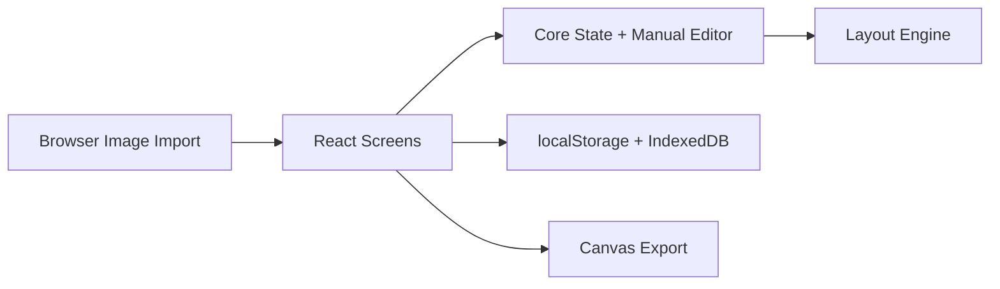

# Auto Layout

## Obiettivo

`auto-layout` e' il primo tool operativo del repository e oggi rappresenta il prodotto principale.
Serve a trasformare una selezione di immagini in fogli multifoto modificabili ed esportabili dal
browser.

## Stato verificato al 16 marzo 2026

Il tool e' gia' utilizzabile end-to-end in ambiente browser e include:

- dashboard con gestione progetti
- wizard di onboarding
- setup del progetto con riepilogo immediato
- planning automatico iniziale
- studio layout con editing manuale
- autosave del progetto
- persistenza immagini in `IndexedDB`
- import/export progetto `.imagetool`
- export fogli `jpg` e `png`

## Workflow supportato oggi

1. creazione o apertura di un progetto
2. caricamento foto reali oppure dataset demo
3. selezione delle foto attive
4. definizione di formato foglio e strategia di planning
5. generazione del piano iniziale
6. revisione nello studio layout
7. esportazione fogli o esportazione del progetto

## Architettura del tool

### Layout engine

Responsabilita':

- scegliere il template migliore
- assegnare le immagini agli slot
- creare la prima distribuzione per foglio

### Core

Responsabilita':

- costruire `AutoLayoutResult`
- applicare modifiche manuali
- ricalcolare warning, immagini libere e render queue

### UI React

Responsabilita':

- gestione delle schermate
- interazioni drag and drop
- editing slot e pagine
- feedback, wizard, modali e export

### Storage browser

Responsabilita':

- salvataggio progetto in `localStorage`
- salvataggio blob immagini in `IndexedDB`

## Funzionalita' attive nello studio layout

Lo studio oggi supporta:

- selezione pagina e slot
- drag and drop foto verso gli slot
- spostamento foto tra slot e pagine
- aggiunta foto a una pagina
- cambio template della pagina
- creazione foglio da foto non usate
- duplicazione foglio
- riordino fogli
- eliminazione foglio con conferma
- modifica `fitMode`, `zoom`, `offsetX`, `offsetY`, `rotation`, `locked`
- pannelli dedicati per output, warning, statistiche e attivita'
- zoom board e fullscreen
- undo/redo

## Gestione progetto

La parte progetto oggi e' una feature reale del tool, non un'aggiunta secondaria.

Funzioni presenti:

- creazione progetto con nome
- apertura progetti salvati
- rinomina progetto
- eliminazione progetto
- export progetto completo in `.imagetool`
- import progetto da file `.imagetool`
- recupero immagini persistite al riavvio dell'app

## Tipi principali in uso

I contratti principali del tool sono:

- `ImageAsset`
- `SheetSpec`
- `LayoutTemplate`
- `LayoutAssignment`
- `GeneratedPageLayout`
- `AutoLayoutRequest`
- `AutoLayoutResult`
- `RenderJob`

## Catalogo template

Il planner usa un catalogo base di template editoriali/multifoto.
La scelta del template puo' essere automatica o manuale per singolo foglio.

La logica di scelta risiede in `packages/layout-engine`; la UI non deve replicarla.

## Output attuale

Output supportati oggi:

- export fogli in `jpg`
- export fogli in `png`
- download progetto in file `.imagetool`

Comportamento attuale:

- la destinazione output puo' usare File System Access API quando il browser la supporta
- in assenza di tale supporto il flusso resta browser-first tramite download

## Limiti attuali

Limiti concreti ancora aperti:

- nessuna integrazione Photoshop / UXP
- nessun export TIFF reale lato browser
- nessuna suite test automatica
- nessun renderer desktop nativo
- preset utente persistenti non ancora separati come feature dedicata

## Verifiche effettuate

Lo stato sopra e' stato verificato il 16 marzo 2026 tramite:

- lettura del codice in `apps/auto-layout-app` e dei package condivisi
- esecuzione di `npm run build`
- esecuzione di `npm run typecheck`

## Direzione successiva consigliata

I prossimi passi piu' coerenti con il tool attuale sono:

1. test automatici per planner e editor manuale
2. salvataggio preset utente
3. renderer desktop o Photoshop per output avanzati
4. refinements UX su onboarding, ribbon foto e activity log
