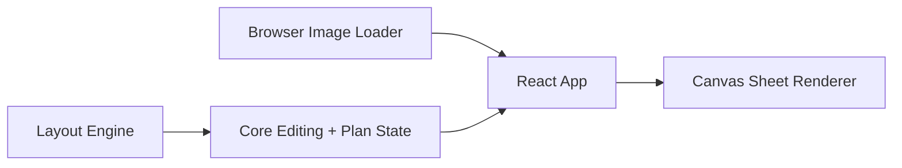

# Auto Layout

## Obiettivo

`auto-layout` e' il primo tool operativo di Photo Tools for Photographers.

Serve a trasformare rapidamente una selezione reale di immagini in fogli multifoto pronti per
vendita, stampa o consegna, con un flusso pensato per l'uso veloce da parte del fotografo durante
eventi e matrimoni.

## Workflow reale supportato

1. import di una cartella immagini `jpg / jpeg / png`
2. analisi base di orientamento e proporzioni
3. generazione automatica dei fogli in base al numero desiderato o al massimo foto per foglio
4. revisione visuale con vere preview fotografiche
5. smistamento manuale delle foto con drag and drop
6. cambio template foglio per foglio
7. rifinitura del singolo slot con zoom, offset, rotazione, lock e svuotamento
8. esportazione browser-side dei fogli rasterizzati

## Stato attuale del tool

Il tool oggi include:

- preview vere delle immagini nei fogli, non solo nomi file
- dataset demo fotografico reale per vedere subito il comportamento dell'app
- sala impaginazione in stile editor album con spread centrale
- banco foto con stato `usata / non usata`
- ribbon foto interna alla sala impaginazione per drag and drop rapido
- drag and drop tra banco foto e fogli
- drag and drop tra slot e fogli diversi
- creazione rapida di un nuovo foglio dalle immagini non usate
- rimozione del singolo foglio con ritorno delle immagini tra le non usate
- controllo per slot di `fitMode`, `zoom`, `offsetX`, `offsetY`, `rotation`, `locked`
- export in `jpg` o `png` dal browser
- scrittura diretta in una cartella locale tramite File System Access API quando disponibile

Nota export:

- se l'utente seleziona `tif`, il browser esporta comunque in `jpg` per limite del renderer canvas
- nel browser non e' possibile ottenere il path assoluto della cartella scelta, quindi la UI mostra
  il nome logico della destinazione

## Architettura

### Layout Engine

Responsabilita':

- batching delle immagini per foglio
- scelta del template piu' coerente
- assegnazione immagini agli slot

### Core

Responsabilita':

- generazione del piano iniziale
- mantenimento dello stato pagine
- operazioni manuali riusabili
- ricalcolo di summary, warning, foto non usate e render queue

### UI App

Responsabilita':

- import immagini
- preview dei fogli
- banco foto
- drag and drop operativo
- controlli per singolo slot
- export browser

### Canvas Renderer

Responsabilita':

- conversione `cm + dpi` in pixel reali
- rispetto dei margini del foglio
- rendering degli slot con `fit / fill / crop`
- export dei file finali

## Tipi principali

### `ImageAsset`

Include:

- metadata base immagine
- `previewUrl`
- `sourceUrl`

### `GeneratedPageLayout`

Rappresenta un foglio con:

- template attivo
- slot
- assegnazioni correnti
- warning eventuali

### `AutoLayoutResult`

Contiene:

- pagine generate
- template disponibili
- foto non usate
- summary operativo
- render queue

## Catalogo template attuale

Template disponibili nel catalogo base:

- `single-hero`
- `single-editorial-band`
- `duo-vertical-columns`
- `duo-horizontal-stack`
- `duo-balanced-split`
- `duo-top-story`
- `trio-editorial`
- `trio-columns`
- `trio-story-grid`
- `grid-four-balanced`
- `four-hero-strip`
- `four-landscape-board`

L'utente puo':

- cambiare template per singolo foglio
- bloccare il contenuto di uno slot
- spostare una foto da un foglio all'altro
- rimuovere una foto e riportarla tra le non usate

## Esperienza utente

La UI e' organizzata in cinque aree operative.

### 1. Sorgente

- caricamento cartella immagini
- switch tra demo e immagini reali
- conteggio verticale / orizzontale / quadrato

### 2. Impostazioni Layout

- preset foglio
- margini
- gap
- DPI
- modalita' `fit / fill / crop`
- scelta tra `fogli desiderati` e `foto per foglio`
- toggle per permettere o meno la variazione automatica dei template

### 3. Anteprima Fogli

- spread centrale con doppia pagina affiancata
- preview reali con immagini
- selezione slot
- cambio template foglio
- pulsante rapido che apre i template compatibili per il foglio attivo
- rimozione foglio
- creazione nuovo foglio da immagini non usate

### 4. Banco Foto

- tutte le immagini del servizio
- badge implicito usata/non usata
- trascinamento verso i fogli dalla ribbon interna o dal banco foto
- drop zone per rimettere una foto tra le non usate

### 5. Controllo Slot

- zoom
- offset orizzontale
- offset verticale
- rotazione
- fit mode
- lock
- svuota slot

### 6. Output

- nome cartella di output
- naming file
- formato
- qualita'
- selezione cartella reale quando supportata dal browser
- esportazione dei fogli renderizzati

## Operazioni core disponibili

Il core espone queste azioni principali:

- `createAutoLayoutPlan`
- `moveImageBetweenSlots`
- `placeImageInSlot`
- `clearSlotAssignment`
- `updateSlotAssignment`
- `changePageTemplate`
- `createPage`
- `removePage`

Queste operazioni mantengono sincronizzati:

- immagini assegnate
- immagini non assegnate
- numerazione fogli
- warning
- render queue

## Limiti attuali

Il tool e' operativo ma ha ancora limiti chiari:

- export TIFF nativo non disponibile nel browser
- nessuna persistenza su disco di preset personalizzati
- nessun `undo / redo`
- nessun crop editor visuale con maniglie dentro lo slot
- nessuna integrazione Photoshop o UXP

## Direzione successiva consigliata

Per le iterazioni future conviene dare priorita' a:

1. `undo / redo`
2. preset utente salvabili
3. crop editor diretto dentro il foglio
4. renderer desktop o Photoshop per export TIFF/PSD reali
5. integrazione con workflow di selezione e vendita eventi
